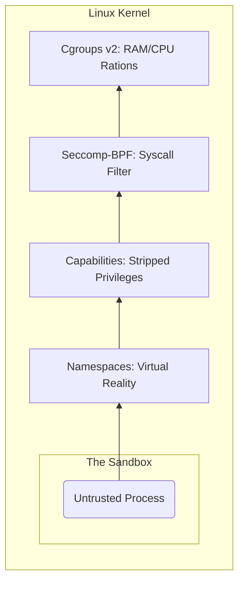
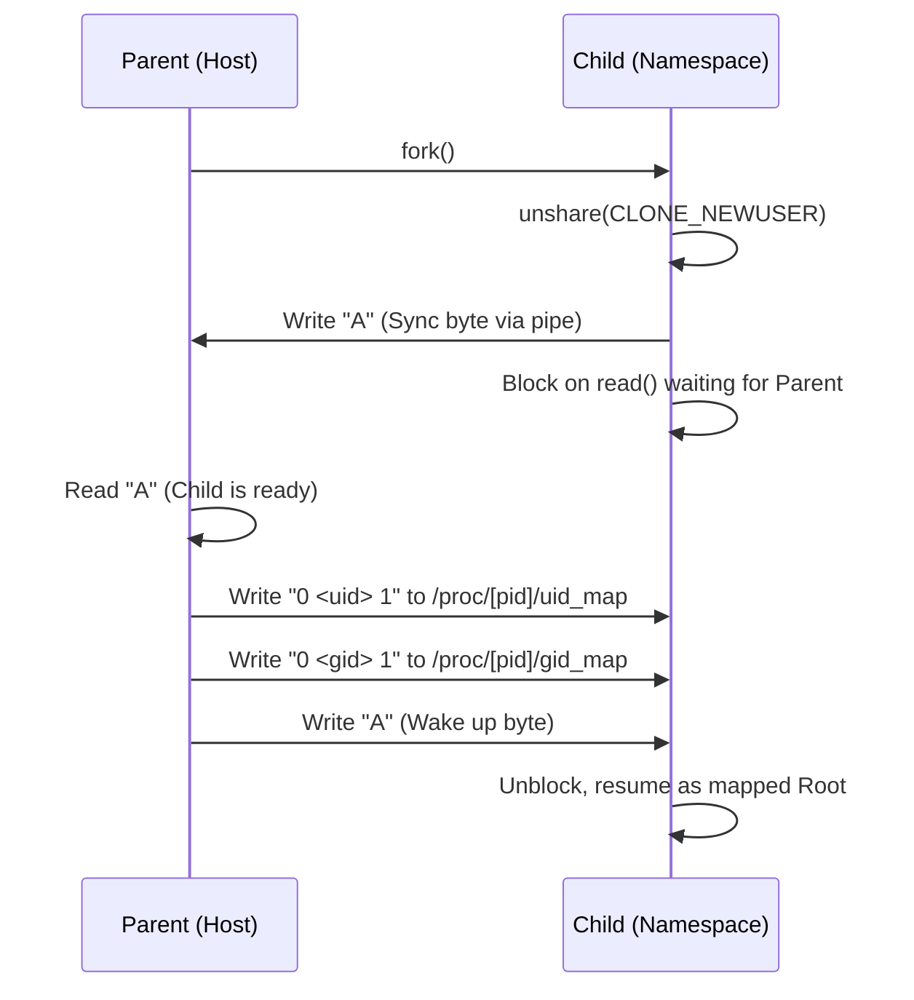
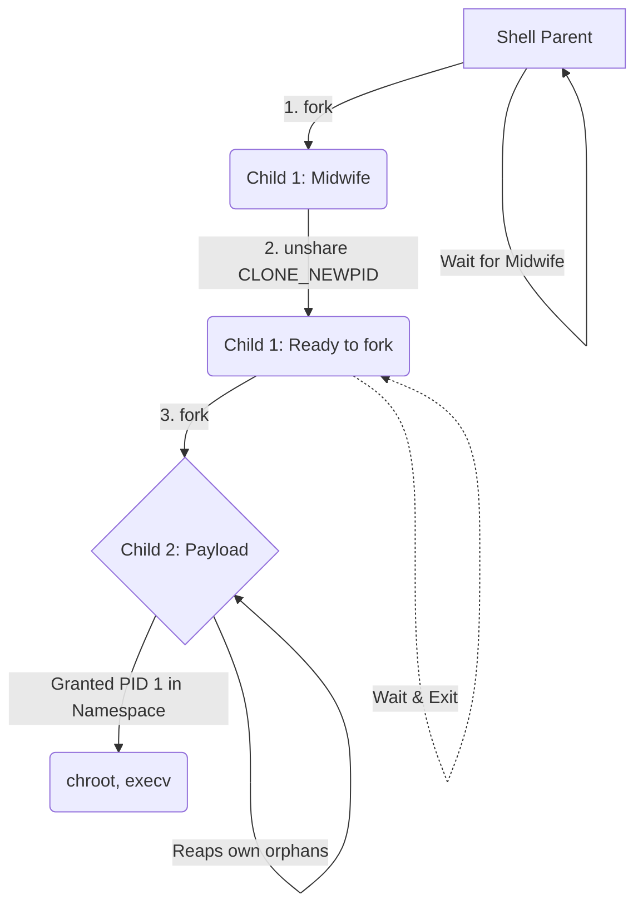

# jailsh
> A Unix shell that doubles as a container runtime using raw Linux kernel primitives.


A Unix shell in C++17 with an AST-based execution engine and a built-in, kernel-enforced sandbox for safely running untrusted programs.

It combines traditional shell functionality (pipelines, job control, redirection) with modern isolation primitives (seccomp-BPF, Linux namespaces, and cgroups), effectively acting as a lightweight container runtime embedded inside a shell.

## Features

- Readline-based REPL with history
- Builtins: `cd`, `echo`, `pwd`, `exit`, `type`, `history`, `jobs`
- AST-based parsing with correct quoting and escape handling
- Multi-stage pipelines (`cmd1 | cmd2 | cmd3`)
- I/O redirection: `>`, `>>`, `2>`, `2>>`, `1>`, `1>>`
- Background execution (`&`) with async `SIGCHLD` reaping
- PATH resolution and tilde expansion
- Integrated `jail` sandbox with CPU/memory/network controls
- Correct Unix semantics (for example, `SIGPIPE` handling)

## Motivation

Modern shells assume trusted execution. This project explores what happens when that assumption is removed.

The goal was to:
- understand process lifecycle and signal handling deeply
- build a correct execution engine under asynchronous conditions
- design a secure execution boundary using kernel primitives

The result is a shell that can safely execute untrusted binaries using a container-like sandbox.

## Structure

```
include/
    executor.h, parser.h, security.h, utils.h
src/
    main.cpp        — REPL loop, SIGCHLD setup
    parser.cpp      — tokenizer, AST construction
    executor.cpp    — execution engine, pipelines, redirection
    security.cpp    — seccomp sandbox policy
    utils.cpp       — PATH resolution, cd, globals
test_security.cpp   — test harness for the sandbox
Makefile
```

`parser.cpp` turns raw input into tokens, `check()` builds an AST from those tokens, and the executor walks the tree. Builtins run in-process; external commands get `fork()`/`execv()`. Pipelines spin up N children connected with `pipe()`.

## Build

Needs g++ (C++17), libreadline-dev, and libseccomp-dev.

```bash
sudo apt install build-essential libreadline-dev libseccomp-dev
make
sudo ./jailsh
```

## Sandbox (`jail`)

A multi-layered, kernel-enforced sandbox that isolates processes using namespaces, seccomp, capabilities, and cgroups.

Prefix any command with `jail` to lock it down:

```
$ jail ./sketchy_binary
```

Show available jail options:

```
$ jail --help
```

What happens under the hood:
- **Linux Namespaces**: `unshare(CLONE_NEWUSER | CLONE_NEWNS | CLONE_NEWPID [+ CLONE_NEWNET with --no-net])` — isolates user, mount, PID, and optionally network namespaces. 
- **Ephemeral Sandbox Workspace**: `myshell` uses `mkdtemp` to construct an entirely new `/tmp/myshell-jail-XXXXXX` environment every single run. It sets up private recursive mounts (`MS_PRIVATE`) and recreates modern UsrMerge system root linkages (symlinking `/bin` to `/usr/bin`, etc.) so that binaries work out-of-the-box on systems like Fedora and modern Debian. Handles Btrfs-specific subvolume boundary issues by using precise `MS_BIND` flag sequencing rather than generic recursive mounts.
- **Hard Copy Sandbox**: Instead of opening up a risky bind-mount portal into your actual working directory, `myshell` securely transplants the target executable into an isolated `/workspace` directory via `std::filesystem::copy_file`. The binary runs in total isolation from your host files.
- **Cgroups v2 Limits**: Instead of solely relying on easily-bypassed `setrlimit` boundaries, physical memory and resources are now constrained using genuine Linux Control Groups (`/sys/fs/cgroup/myshell-<pid>`).
- **Zero Footprint Exit**: A custom bi-directional IPC pipe cleanly syncs initialization between the parent and forked child/grandchild (preventing race conditions during ID mapping). The moment the untrusted process exits, the parent catches `waitpid` and immediately cleans up the temporary filesystem workspace and kernel `cgroups` block.
- **Capabilities Sandbox**: Linux capabilities are fully locked down (`capset` + bounding-set drop via `drop_all_capabilities()`), removing privileged kernel capabilities before exec.
- **seccomp-bpf**: A strict syscall allowlist filters system calls via `apply_jail_policy()`. Everything else terminates the process immediately (`SCMP_ACT_KILL`). `openat` is only allowed read-only. `write` is restricted to fd 1 and 2.
- `prctl(PR_SET_NO_NEW_PRIVS)` — can't escalate privileges.
- All FDs above 2 are closed before `execv`.

### Layers of Isolation (The Vault)

The jail is structured like a vault. The payload is surrounded by concentric filters, each enforced by the Linux kernel.



## Filesystem Isolation

The sandbox isolates the filesystem using **mount namespaces, bind mounts, and `chroot`**, without overlay or union filesystems.

### Implemented
- Mount namespace isolation (`CLONE_NEWNS`)
- Private mounts (`MS_PRIVATE`)
- Ephemeral root (`/tmp/myshell-jail-*`)
- Selective bind mounts for required paths
- `chroot` confinement

### Not implemented
- No overlay/union filesystem
- No copy-on-write layers
- No container image abstraction


### Interactive testing (recommended)

Run these directly inside `sudo ./jailsh`:

```
$ jail --help

$ jail --cpu 5 --mem 256M echo hello

$ jail --mem bad /bin/echo should-fail
# expected: jail: invalid --mem value 'bad'

$ jail --cpu nope /bin/echo should-fail
# expected: jail: invalid --cpu value 'nope'

$ jail --wat /bin/echo should-fail
# expected: jail: unknown option '--wat'

$ jail --cpu 2 --mem 128M --no-net ping -c 1 1.1.1.1
# expected: network operation fails inside jail

$ yes | head -n 1
# expected: prints one line and returns immediately
```

### Scripted testing (optional)

If you want repeatable non-interactive tests, piping commands is fine too:

```bash
printf "jail --help\njail --cpu 5 --mem 256M echo hello\nexit\n" | sudo ./jailsh
```

There's a `test_security.cpp` you can compile separately to verify each constraint:

```bash
g++ -std=c++17 test_security.cpp -o test_security
sudo ./jailsh
$ jail ./test_security net     # network blocked
$ jail ./test_security fork    # fork bomb capped
$ jail ./test_security mem     # allocation fails at limit
$ jail ./test_security cpu     # killed after ~2s
```

## Key Challenges Solved

- Fixed a fork/SIGCHLD race that caused ghost jobs
- Implemented correct PID namespace isolation via double-fork (PID 1 init model)
- Solved UID/GID mapping dependency in `CLONE_NEWUSER` using an IPC handshake
- Designed an async-signal-safe job tracking and reap path

## Validation

- Handles fork bombs safely via cgroup constraints
- Avoids zombie leakage under high process churn
- Preserves correct pipeline termination (`yes | head -n 1`)
- Enforces memory and CPU limits via cgroups
- Verifies network isolation with `--no-net`

## Technical deep-dive

This section documents the non-obvious problems I ran into and the decisions behind the current implementation. Most of these are concurrency issues around signal handling and process management.

### The fork/SIGCHLD race

This was the nastiest bug. The scenario:

1. Shell calls `fork()`, gets back a PID.
2. Child exits immediately (like `true &` — runs in microseconds).
3. Kernel delivers `SIGCHLD` before `execute_pipeline()` even gets to `jobs.push_back()`.
4. Signal handler reaps the child via `waitpid()`.
5. Shell then adds the (already dead) PID to the jobs list as "Running."

Now you've got a ghost job that shows up in `jobs` forever because nobody will ever reap it again.

The fix: block `SIGCHLD` before forking, do all the bookkeeping, then unblock:

```cpp
sigprocmask(SIG_BLOCK, &mask, &oldmask);  // hold signals
pid_t pid = fork();
// ... push to jobs ...
sigprocmask(SIG_SETMASK, &oldmask, nullptr);  // release
```

Simple in hindsight, but this class of bug only shows up with fast-exiting background processes — so it's easy to miss during casual testing.

### Why `waitpid(-1)` instead of per-PID polling

The first version iterated through the entire `jobs` vector each prompt and called `waitpid()` on every PID individually. That's N syscalls per Enter press regardless of whether anything died. With 50 background jobs and 1 dead child, you're making 50 kernel calls for no reason.

Current approach:

```cpp
while ((reaped_pid = waitpid(-1, &status, WNOHANG)) > 0) {
    // look up reaped_pid in jobs, remove it
}
```

This asks the kernel "give me anyone who's dead" — it returns K+1 times (K dead children + 1 to say "nobody left"). Way fewer syscalls.

The other reason this matters: **Unix signals are lossy.** If three children die at the same time, the kernel might coalesce them into a single `SIGCHLD`. If you only reap once per signal, you leave zombies. The `while` loop drains the entire queue.

### `ECHILD` handling

`waitpid()` can return -1 with `errno == ECHILD`, which means "you have no children left to wait for." This happens legitimately when the signal handler already reaped a child before the main loop got to it. Rather than treating it as an error, the code takes it to mean "this job is done" — otherwise you'd accumulate stale entries.

### `wait(NULL)` is a trap

An earlier version used `wait(NULL)` to collect foreground pipeline children. Problem: `wait()` picks up *any* dead child. If a background job dies while you're waiting on a foreground pipeline, `wait()` grabs it, and the background job's entry in `jobs` never gets cleaned up.

Fixed by waiting on specific PIDs:

```cpp
for (int i = 0; i < n; i++) {
    waitpid(children_pids[i], &status, 0);
}
```

### Signal handler constraints

`SIGCHLD` can arrive literally anywhere — including inside `malloc()`. If the handler also calls `malloc()` (or `printf`, or `cout`, which call `malloc`), you deadlock on the heap lock. So the handler only uses async-signal-safe functions:

```cpp
void sigchld_handler(int sig) {
    int saved_errno = errno;
    while (waitpid(-1, nullptr, WNOHANG) > 0)
        child_changed = 1;
    errno = saved_errno;
}
```

`child_changed` is `volatile sig_atomic_t` — the only type that's safe to share between a signal handler and normal code without synchronization.

`errno` gets saved/restored because `waitpid()` can modify it, and if the main thread was halfway through a syscall that also checks `errno`, you'd corrupt its error state.

### Deferred job notifications

Background job completion ("Done") is printed at the top of the REPL loop, not inside the signal handler. This is intentional: if you print from the handler, you'll corrupt whatever the user is currently typing into readline. The trade-off is that you only see the notification after hitting Enter.

The "real" fix would be to call `rl_redisplay()` from the handler to refresh the prompt, but that introduces a lot of complexity around making readline cooperate with async output. Since bash also uses deferred job notifications, I decided to stick with the same.

### SIGPIPE behavior in pipelines

The shell process ignores `SIGPIPE` so it doesn't die if it ever writes to a closed pipe.

Child processes restore `SIGPIPE` to default before `execv()`, which preserves normal Unix behavior for tools in pipelines.

Example: in `yes | head -n 1`, `head` exits after one line and `yes` receives `SIGPIPE` and terminates.

### `dup2` over `dup3`

I went with `dup2()` for redirection. `dup3()` is nicer on Linux because it sets `O_CLOEXEC` atomically (no race window between dup and fcntl in multithreaded code), but it's Linux-only. Since the shell is single-threaded, the race doesn't apply here. For extra safety, all FDs above 2 are force-closed before `execv()` anyway.

For a production/multithreaded codebase, you'd want:
```cpp
#ifdef __linux__
    dup3(oldfd, newfd, O_CLOEXEC);
#else
    dup2(oldfd, newfd);
    fcntl(newfd, F_SETFD, FD_CLOEXEC);
#endif
```

POSIX portability won out here.

### Vector erasure during iteration

Removing from `std::vector` while iterating — the classic C++ footgun. `erase()` invalidates the iterator. The safe pattern is `it = jobs.erase(it)` which returns the next valid position.

Worth noting: `vector::erase` from the middle is O(N) due to element shifting. If the jobs list got large, switching to `std::list` or `std::unordered_map<pid_t, Job>` would give O(1) removal at the cost of cache locality. Not a problem at shell scale though.

### Pipeline PID tracking

For a background pipeline like `ls | grep foo | sort &`, only the last PID (`sort`) is stored in the jobs list. This matches how bash does it — pipeline status is defined by the final stage. The job is "Done" when the last command exits.

### Terminal state recovery

After a foreground process exits, the shell runs:

```cpp
tcsetpgrp(STDIN_FILENO, getpgrp());
tcsetattr(STDIN_FILENO, TCSADRAIN, &shell_tmodes);
```

`shell_tmodes` is captured at startup. If a child process messes with terminal settings (raw mode, disabling echo, etc.) and then crashes without restoring them, the shell would inherit a broken terminal. This restores sanity.

---

### The `CLONE_NEWUSER` Circular Dependency (IPC Handshake)

When sandboxing a process, it needs to be `root` inside its own namespace to set up `chroot` and mounts. The scenario:
1. Child calls `unshare(CLONE_NEWUSER)` to isolate itself.
2. To act as `root` inside this new bubble, it needs to map its UID to 0 by writing to `/proc/self/uid_map`.
3. The catch: Because it just unshared, it lost all capabilities in the parent namespace and is now the `nobody` user. The kernel immediately denies the write (`EPERM`).

The fix: A highly synchronized parent-child handshake using bidirectional pipes. 
The child unshares and immediately blocks (reading from a pipe). The parent—which is still outside the jail and retains host privileges—intercepts this, writes the UID mapping to the child's `/proc/[pid]/uid_map`, and then writes a byte to the pipe to wake the child up. The child resumes execution with its newly granted authority.



### The `CLONE_NEWPID` Trap

When isolating a process's PID, you might assume calling `unshare(CLONE_NEWPID)` teleports the process into a new PID namespace. 

It doesn't. In Linux, a process can *never* change its own PID. `unshare(CLONE_NEWPID)` only dictates that the process's *future children* will be put into a new namespace. If you just unshare and `execv()` the payload, the untrusted code still runs in the host's PID namespace, completely defeating the sandbox and leaking zombie processes.

The fix: The "Midwife" pattern (a strict double-fork).  
1. The shell forks Child 1 (The Midwife).
2. The Midwife calls `unshare(CLONE_NEWPID)` and immediately forks Child 2.
3. Child 2 is born directly inside the new namespace and is granted **PID 1**. It acts as the `init` process for the sandbox, capable of reaping orphans and ensuring the kernel cleanly destroys the entire namespace when the payload exits.


### Resource Accounting: Physical vs. Virtual RAM

`myshell` manages Resident Set Size (RSS) using Cgroups v2 (`memory.max`) instead of traditional virtual memory limits (`RLIMIT_AS`).

* **Allocator Compatibility**: Modern runtimes (Go, Rust, and C++ with jemalloc) often pre-reserve large virtual address spaces. `RLIMIT_AS` can cause these to crash on startup regardless of actual RAM usage.
* **Accuracy**: Virtual limits penalize processes for shared libraries. Cgroups track the actual physical pages consumed by the sandbox.
* **Kernel Integration**: When a process reaches its limit, the kernel triggers a targeted OOM-kill within that specific cgroup. This prevents the process from exhausting host resources without impacting the parent shell.

This shift was made after ./the_hi was not working even after allocating 128M, because libs required approx. 233M of virtual mem reservation before the actual execution.

| Metric | RLIMIT_AS | memory.max |
| :--- | :--- | :--- |
| **Monitors** | Virtual Address Space | Physical RAM (RSS) |
| **Constraint** | Address space reserved | Hardware consumed |
| **Outcome** | malloc returns NULL | Kernel OOM-kill |

## Debugging with `strace`

If you are trying to understand how `jailsh` interacts with the kernel, or why a specific sandbox constraint is failing, `strace` is your best friend.

Because the `jail` mode requires root privileges (primarily to configure kernel `cgroups` and Linux namespaces), directly running `strace sudo ./jailsh` often clutters your output with `sudo` wrapper syscalls, or causes `ptrace` permission issues when privileges drop. 

The cleanest way to trace a jail execution is the two-terminal hack:

**Terminal 1 (The Shell):**
Start the shell as root:
```bash
$ sudo ./jailsh
```

**Terminal 2 (The Tracer):**
Find the PID of `jailsh` and attach `strace` to that PID as root. The `-f` flag is crucial so it follows all the child processes and `fork()`s.
```bash
$ pgrep jailsh
12345
$ sudo strace -f -p 12345
```

*(Optional: Add filters to reduce noise and only observe sandboxing mechanics)*:
```bash
$ sudo strace -f -e trace=clone,unshare,execve,prctl,seccomp -p 12345
```

Now, go back to **Terminal 1** and run your jailed command:
```bash
$ jail ./sketchy_binary
```

All the raw kernel interactions, namespace isolations, and seccomp kills will cleanly stream into Terminal 2 without visually corrupting your `jailsh` REPL!
